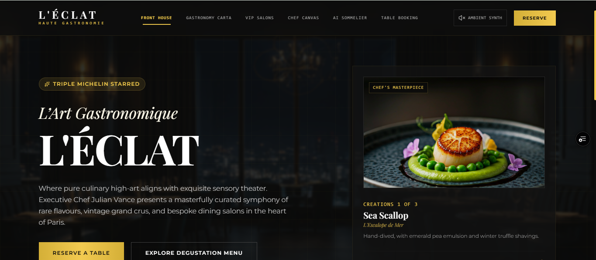
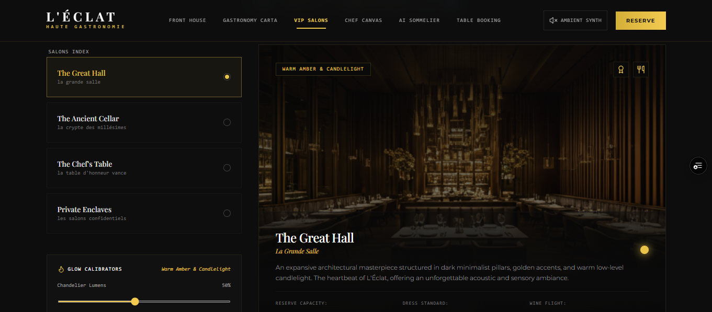
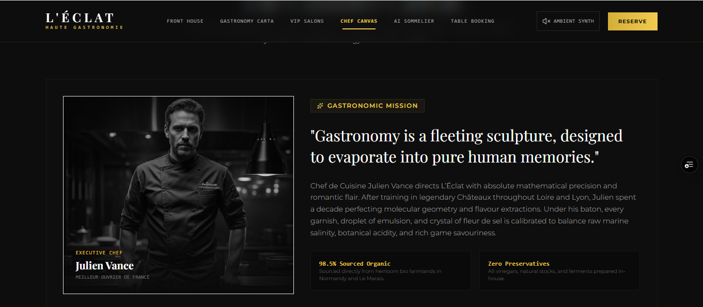
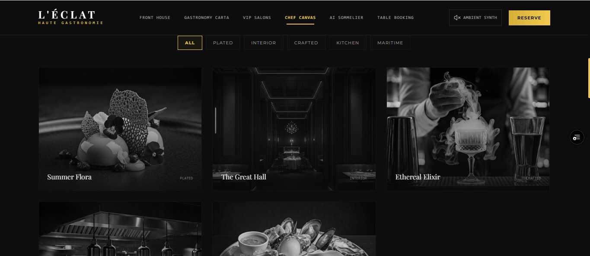
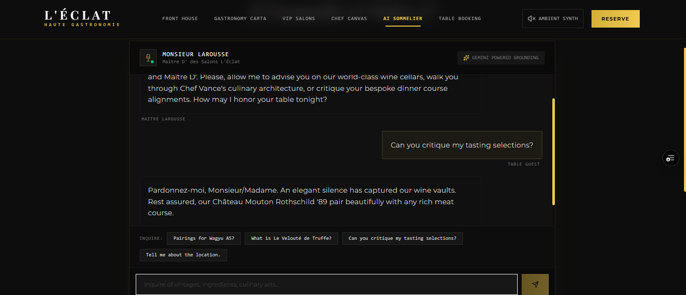
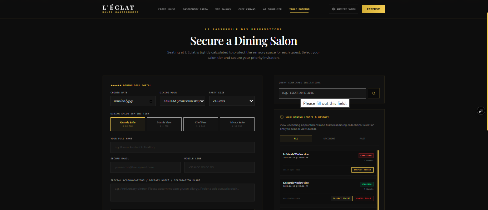
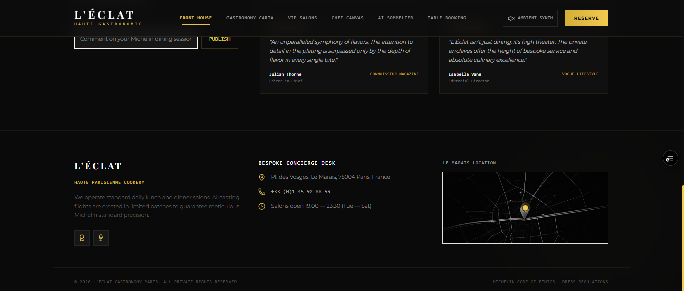

# 🍽️ Restaurant Demo — Luxury Fine Dining Experience

<div align="center">

# Restaurant Demo

### Premium Restaurant Website Experience Built with React, TypeScript & AI

Live Demo:

👉 **https://restaurant-demo-sable.vercel.app/**

[View Live Website](https://restaurant-demo-sable.vercel.app/)

</div>

---

## 🌟 Live Preview

<p align="center">
  <a href="https://restaurant-demo-sable.vercel.app/">
    
  </a>
</p>

---

## 📸 Project Showcase

<p align="center">
  
  
  
</p>

<p align="center">
  
  
  
</p>

---
---

## ✨ Features

### 🍷 AI Sommelier Assistant

Get intelligent wine recommendations and dining suggestions.

### 📅 Smart Reservation System

Luxury reservation experience with intuitive booking flow.

### 👨‍🍳 Chef Experience Section

Immersive culinary storytelling and visual presentation.

### 🍽️ Premium Gastronomy Menu

Elegant menu showcase designed for luxury restaurants.

### 🌙 Dynamic Ambiance Controls

Interactive atmosphere and dining environment experience.

### 📱 Fully Responsive

Optimized for desktop, tablet, and mobile devices.

---

## 🚀 Live Website

https://restaurant-demo-sable.vercel.app/

---

## 🛠 Tech Stack

* React 19
* TypeScript
* Vite
* Tailwind CSS
* Express.js
* Google Gemini AI

---

## 📦 Installation

```bash
git clone https://github.com/sujeetvishwakarma83/restaurant-demo.git

cd restaurant-demo

npm install

npm run dev
```

---

## 🌍 Business Value

This project demonstrates how modern restaurants can:

* Increase online reservations
* Improve customer engagement
* Strengthen brand perception
* Deliver luxury dining experiences online
* Boost conversions through premium UI/UX

---

## 👨‍💻 Developed By

# CabbageCode

Premium Web Development & UI/UX Design Agency

### Services

* Custom Websites
* SaaS Applications
* React Development
* Next.js Development
* UI/UX Design
* Landing Pages
* Business Automation

---

## ⭐ Support

If you like this project:

⭐ Star this repository

🍴 Fork this repository

🚀 Share it with others

---

<div align="center">

### Built with ❤️ by CabbageCode

</div>
